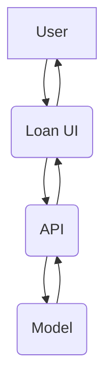
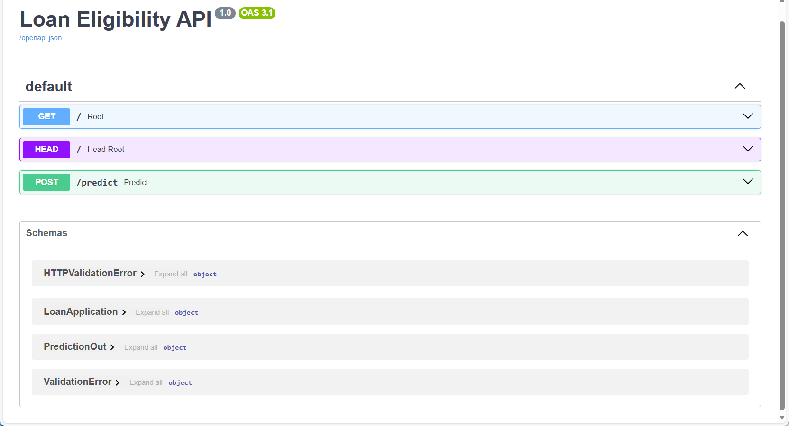

# 🏦 Loan Eligibility Predictor

An end-to-end **Machine Learning Web Application** that predicts whether a loan application will be **Approved ✅ or Not Approved ❌**, based on applicant details such as income, employment, education, and credit history.  
Built using **FastAPI (Backend)** and **Streamlit (Frontend)** — and deployed seamlessly on **Render Cloud**.

---

## 📘 Overview

This system helps financial institutions or users check **loan eligibility** instantly using a trained ML model (Random Forest Classifier).  
It provides both:
- 🔹 **Approval prediction**
- 🔹 **Confidence probability score**

---

## ✨ Key Features

| Feature | Description |
|----------|--------------|
| 🤖 ML Loan Approval Prediction | Predicts eligibility & confidence probability |
| ⚙️ FastAPI Backend | REST API with Swagger documentation |
| 🖥️ Modern Streamlit UI | Responsive, elegant user interface |
| 🔁 Real-Time Integration | Streamlit UI interacts live with FastAPI |
| ☁️ Cloud Deployment | Deployed on Render (Free Tier) |

---

## 🏛️ System Architecture




## 🖼️ Screenshots

### Streamlit Frontend (Loan Eligibility Predictor UI)
<p align="center">
  
</p>

### FastAPI Backend (Swagger API Docs)
<p align="center">
  
</p>


🚀 Live Demo

Component	Link

🌐 Streamlit UI (Frontend)	https://loan-ui.onrender.com

⚙️ FastAPI Backend (API)	https://loan-api-z9u8.onrender.com

🧠 Tech Stack

Frontend: Streamlit

Backend: FastAPI

Machine Learning: Scikit-learn, Pandas, NumPy

Model: Random Forest Classifier

Deployment: Render (Free Tier)

Version Control: Git & GitHub

⚙️ Run Locally

Clone the project:

git clone https://github.com/sobiya57/loan-eligibility.git


Navigate to the project directory:

cd loan-eligibility


Create and activate a virtual environment:

python -m venv venv
venv\Scripts\activate   


Install dependencies:

pip install -r requirements.txt


Run the FastAPI server:

uvicorn app.api:app --reload


Run the Streamlit app:

streamlit run app/streamlit_app.py

### 📁 Folder Structure

```
loan-eligibility/
├── app/
│   ├── api.py
│   ├── schema.py
│   ├── streamlit_app.py
│   ├── utils.py
│   └── model/
│       └── model.pkl
├── data/
│   └── train.csv
├── docs/
│   ├── ui_screenshot.png
│   └── swagger_screenshot.png
├── requirements.txt
├── runtime.txt
└── README.md
```

🤝 Contributing

Contributions, issues, and feature requests are welcome!
Feel free to fork the repo and submit a pull request.

💡 Author

Sobiya Begum
🌍 GitHub Profile

📧 Contact: – sobiyabegumbegum@gmail.com

