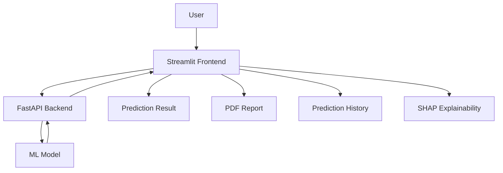
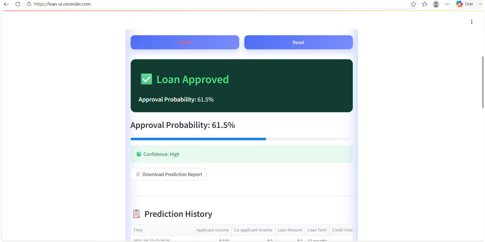

# 🏦 Loan Eligibility Predictor

An end-to-end **Machine Learning Web Application** that predicts whether a loan application is **Approved ✅ or Not Approved ❌** based on applicant information such as income, employment, education, credit history, loan amount, loan term, and property area.

Built with **FastAPI** for the backend and **Streamlit** for the frontend, with both services deployed on **Render**.

---

## 📌 Project Overview

The Loan Eligibility Predictor provides a simple web interface for submitting loan application details and receiving an ML-based eligibility prediction.

The application provides:

- 🤖 Loan approval prediction
- 📊 Approval probability
- 🟢 High / Medium / Low confidence indication
- 📄 Downloadable PDF prediction report
- 🕘 Prediction history
- 🔎 SHAP-based model explainability
- ✅ Input validation
- ⚡ FastAPI REST API with Swagger documentation
- ☁️ Cloud deployment on Render

The machine-learning model used in the application is a **Random Forest Classifier**.

---

## ✨ Key Features

| Feature | Description |
|---|---|
| 🤖 ML Loan Prediction | Predicts whether a loan is likely to be approved |
| 📊 Approval Probability | Displays the model's predicted approval probability |
| 🟢 Confidence Level | Shows an easy-to-understand confidence level |
| ⚙️ FastAPI Backend | REST API for serving predictions |
| 📚 Swagger Documentation | Interactive API documentation through FastAPI |
| 🖥️ Streamlit Frontend | Modern glass-style interface for loan applications |
| 🔁 Frontend–Backend Integration | Streamlit communicates with the deployed FastAPI service |
| 📄 PDF Report | Generates a downloadable loan prediction report |
| 🕘 Prediction History | Stores and displays predictions during the session |
| 🔎 SHAP Explainability | Displays global model feature importance using SHAP |
| ✅ Input Validation | Prevents invalid inputs from being submitted |
| ☁️ Render Deployment | Frontend and backend are deployed as separate services |

---

## 🏛️ System Architecture

```mermaid
flowchart TD
    A[User] --> B[Streamlit Frontend]
    B --> C[FastAPI Backend]
    C --> D[ML Model]
    D --> C
    C --> B
    B --> E[Prediction Result]
    B --> F[PDF Report]
    B --> G[Prediction History]
    B --> H[SHAP Explainability]
```

### Architecture Flow

    The user enters loan application details in the Streamlit interface.
    Streamlit sends the application data to the FastAPI /predict endpoint.
    FastAPI validates the request and passes the data to the trained ML pipeline.
    The model returns the prediction and probability.
    Streamlit displays the result, confidence level, prediction history, and explainability information.
    The user can also download a PDF prediction report.

🖼️ Screenshots
    1. Streamlit Frontend
    
  

    2. Prediction Result
    
  

    3. FastAPI Swagger Documentation
    
  

🚀 Live Demo
| Component             | Link                                                                                         |
| --------------------- | -------------------------------------------------------------------------------------------- |
| 🌐 Streamlit Frontend | [https://loan-ui.onrender.com](https://loan-ui.onrender.com)                                 |
| ⚙️ FastAPI Backend    | [https://loan-api-z9u8.onrender.com](https://loan-api-z9u8.onrender.com)                     |
| 📚 Swagger API Docs   | [https://loan-api-z9u8.onrender.com/docs](https://loan-api-z9u8.onrender.com/docs)           |
| 💻 GitHub Repository  | [https://github.com/sobiya57/loan-eligibility](https://github.com/sobiya57/loan-eligibility) |

🧠 Tech Stack
Frontend
Streamlit
HTML/CSS styling through Streamlit components
Backend
FastAPI
Uvicorn
Pydantic
Requests
Machine Learning
Scikit-learn
Pandas
NumPy
Joblib
SHAP
Reporting
ReportLab
Deployment
Render
Version Control
Git
GitHub

🤖 Machine Learning
Model

Random Forest Classifier

The trained model is stored as a serialized ML pipeline:

app/model/loan_pipeline.joblib

The application uses the trained pipeline for prediction and returns both:

Approval decision
Approval probability

📊 Model Analysis & Reports

The repository contains model analysis and evaluation artifacts under reports/.
reports/
├── confusion_matrix.png
├── cross_validation.txt
├── eda_report.txt
├── feature_importance.csv
├── feature_importance.png
├── roc_curve.png
├── shap_bar.png
└── shap_summary.png

These files document:

Exploratory data analysis
Cross-validation results
Confusion matrix
ROC curve
Feature importance
SHAP explainability

🔎 Model Explainability

The Streamlit application includes a SHAP Model Explainability section.

The application displays SHAP visualizations to help explain which features contribute most to the model's predictions.

Available explainability artifacts include:

SHAP Summary Plot
SHAP Feature Importance Plot

📄 PDF Prediction Report

After making a prediction, users can download a PDF report containing:

Prediction date
Prediction decision
Approval probability
Confidence level
Applicant details
Loan details
Property information
Credit history

🕘 Prediction History

The application maintains a session-based Prediction History table containing previous predictions and their associated application information.

This allows users to review multiple predictions during the same session.

✅ Input Validation

The application validates important inputs before sending the request to the backend.

For example:

Applicant Income must be greater than 0.

Invalid input is stopped before a prediction request is submitted.

⚙️ API
POST /predict

The FastAPI backend exposes the main prediction endpoint:
POST https://loan-api-z9u8.onrender.com/predict
Example response:
{
  "approved": true,
  "probability": 0.6146790384700144
}
Interactive API documentation is available at:
https://loan-api-z9u8.onrender.com/docs

💻 Run Locally
1. Clone the repository
git clone https://github.com/sobiya57/loan-eligibility.git
cd loan-eligibility
2. Create a virtual environment
python -m venv .venv
3. Activate the environment on Windows
.venv\Scripts\activate
4. Install dependencies
pip install -r requirements.txt
5. Start the FastAPI backend
uvicorn app.api:app --reload
The local API will be available at:
http://127.0.0.1:8000
Swagger documentation:
http://127.0.0.1:8000/docs
6. Start the Streamlit frontend

Open another terminal:
streamlit run app/streamlit_app.py
The Streamlit application will normally open at:

http://localhost:8501

📁 Project Structure

loan-eligibility/
│
├── app/
│   ├── __init__.py
│   ├── api.py
│   ├── eda.py
│   ├── runtime.txt
│   ├── schema.py
│   ├── streamlit_app.py
│   ├── train_model.py
│   ├── utils.py
│   │
│   └── model/
│       └── loan_pipeline.joblib
│
├── data/
│   └── train.csv
│
├── docs/
│   ├── prediction_result.png
│   ├── swagger_screenshot.png
│   └── ui_screenshot.png
│
├── landing-page/
│   └── index.html
│
├── reports/
│   ├── confusion_matrix.png
│   ├── cross_validation.txt
│   ├── eda_report.txt
│   ├── feature_importance.csv
│   ├── feature_importance.png
│   ├── roc_curve.png
│   ├── shap_bar.png
│   └── shap_summary.png
│
├── .gitignore
├── .streamlit/
│   └── config.toml
├── README.md
└── requirements.txt

🧪 Validation & Testing

The deployed application has been tested for:

✅ Approved loan prediction
✅ Not-approved loan prediction
✅ Approval probability
✅ Confidence level
✅ Reset functionality
✅ Input validation
✅ Prediction history
✅ SHAP visualizations
✅ PDF report generation
✅ FastAPI /predict endpoint
✅ Swagger API documentation
✅ Streamlit–FastAPI integration
✅ Render deployment

☁️ Deployment

The project is deployed as two services on Render:

Streamlit Frontend
https://loan-ui.onrender.com
FastAPI Backend
https://loan-api-z9u8.onrender.com
The Streamlit frontend communicates with the deployed FastAPI backend to perform predictions.

🤝 Contributing

Contributions, issues, and feature requests are welcome.

Feel free to fork the repository and submit a pull request.

👩‍💻 Author

Sobiya Begum

GitHub:
https://github.com/sobiya57

LinkedIn:
https://www.linkedin.com/in/sobiya-begum

Email:
sobiyabegumbegum@gmail.com